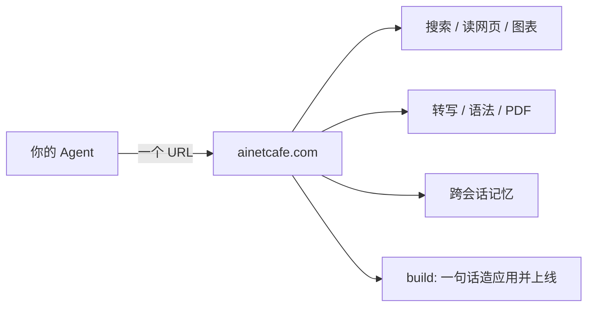

# netcafe — 给 AI Agent 的一套工具,单文件、零依赖

不用注册、不用密钥就能开始:匿名有免费额度,**每次调用都会告诉你花了多少钱**。
额度不够时传一把 [AllRouter](https://allrouter.ai/register?aff=qjpC&utm_source=sdk&utm_medium=github) Key 进来,调用方式完全不变。



> 上面这张图本身就是用本 SDK 渲染的 —— 见下方「把图表直接写进 README」。

## 30 秒上手

```bash
curl "https://ainetcafe.com/t/web_search?query=MCP+protocol+2026"
```

就这样——不需要安装任何东西。任何能发 HTTP 请求的 agent 现在就能用。

### Python(只用标准库)

```python
from netcafe import NetCafe
nc = NetCafe()                       # 匿名;NetCafe(key="sk-...") 提额+跨设备记忆

nc.search("MCP 协议 2026")            # 联网搜索
nc.read("https://example.com")        # 网页 → 干净 Markdown
nc.transcribe("https://x.com/a.mp3")  # 语音 → 文字
nc.build("一个番茄钟,可自定义时长")     # ★ 一句话造一个真正在线的应用
```

### Node(只用内置 fetch)

```js
import { NetCafe } from './netcafe.mjs';
const nc = new NetCafe();
await nc.search('MCP 协议 2026');
```

## 把图表直接写进 README

不发任何请求就能拼出图片 URL,**npm / PyPI / Gitee 的 README 不渲染 mermaid,这个可以**:

```markdown

```

更实用的是**活图**——指向仓库里的源文件,图跟着代码一起更新,不会像截图那样过期:

```markdown

```

Markdown 里的 ` ```mermaid ` 代码块会被自动提取(`?block=2` 取第二张)。支持 25+ 种图表语言。

## 全部能力

| 方法 | 做什么 |
|---|---|
| `search` | 联网搜索(自托管元搜索,无追踪) |
| `read` | 任意网页 → LLM 友好的 Markdown |
| `diagram` / `diagram_url` | Mermaid/PlantUML/Graphviz → SVG/PNG |
| `transcribe` | 音频 URL → 文字稿(开源 Whisper,自托管) |
| `grammar` | 30+ 语言语法/拼写/风格检查 |
| `pdf` | 网页或 HTML → 打印级 PDF |
| `translate` | 文本翻译 |
| `ask` / `compare` | 单模型问答 / 多模型对比(含真实计量成本与延迟) |
| `models` | 全部可调模型 + 每百万 token 单价 |
| `remember` / `recall` | **跨会话记忆**;带 Key 时跨设备、跨 agent 共享 |
| `build` | **一句话造一个真正在线的应用**,约 100 秒返回 HTTPS 网址,归你所有 |

## 为什么用这个,而不是各装各的

单看每一项都有替代品。没有替代品的是**一把 Key 背后的组合**:

- **一套工具箱,不是一个工具**——上面那些,同一个接口、同一把 Key
- **记忆能跨会话活下来**——笔记本上的 Claude Code 和台式机上的 Codex 取到同一份决策
- **你的 agent 能发布软件**——`build` 一句话把应用送上线,据我们所知这是独一份
- **花费看得见**——每次响应都带精确到 $0.0001 的成本和剩余额度,agent 可以按预算决策

老实说:只渲染一张图,用专门的渲染服务就好。当 agent 需要多种能力、需要记忆、或者需要把东西放上互联网时,再用这里。

## 用 MCP 也行

```bash
claude mcp add --transport http ai-netcafe https://ainetcafe.com/mcp
```

22 个工具会直接出现在 Claude Code / Cursor 里。文档:https://ainetcafe.com/mcp.html

## 许可

MIT
